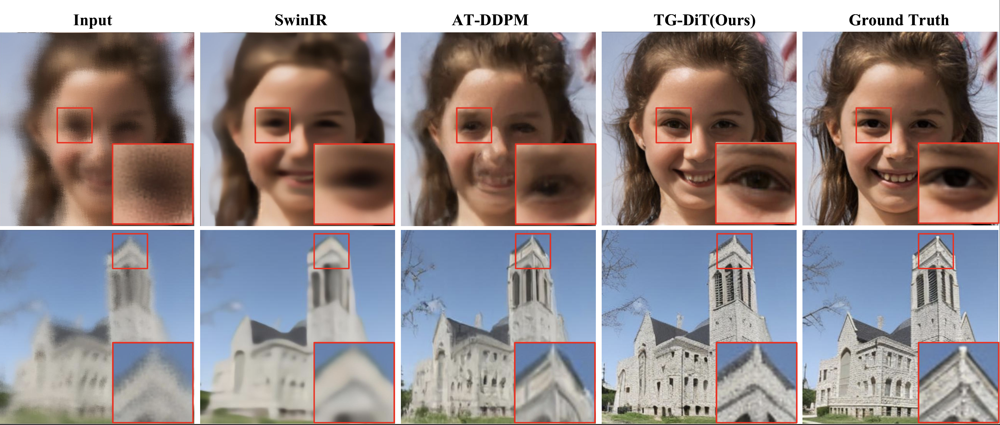
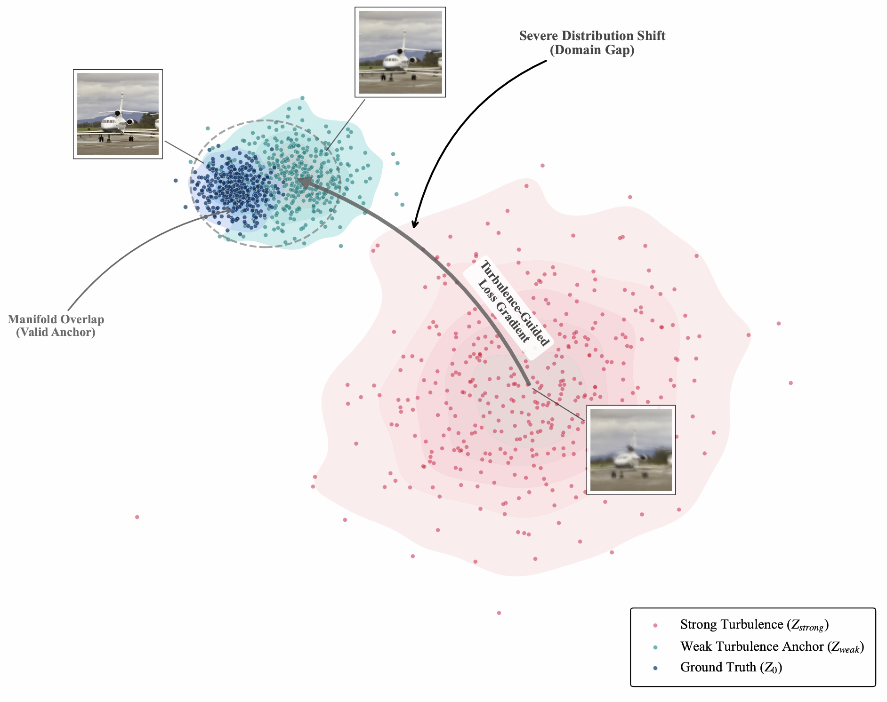
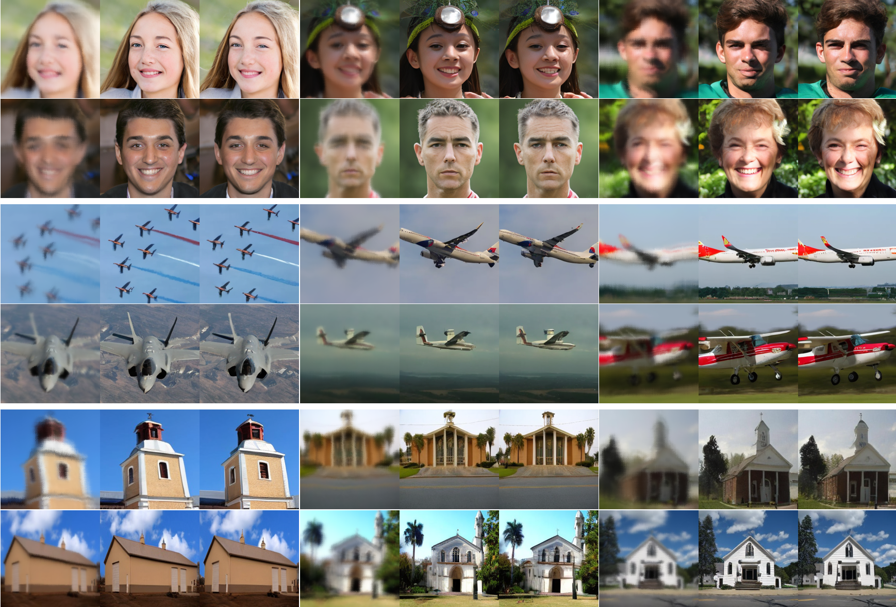

# TG-DiT:  A Turbulence-Guided Diffusion Transformer for Atmospheric Turbulence Image Restoration

<div align="center">

<!-- Logo: 如果未来有logo放这里，没有就留空 -->
<!--  -->

<!-- 只有在论文录用后，才放 arXiv 和 PDF 链接。现在用占位符 -->
[](https://github.com/TG-DiT)
[](https://pytorch.org/)
[](LICENSE)
[]()

</div>

<p align="center">
  
  
</p>

## 📖 Abstract

> **Note:** This paper is currently under review. The full code and pretrained models will be released upon acceptance.

Single-image atmospheric turbulence restoration is a challenging inverse problem in computational imaging. Aiming to resolve the physical unfaithfulness in current generative models, this study proposes the **Turbulence-Guided Diffusion Transformer (TG-DiT)**. 

Motivated by thermodynamic statistical consistency, our framework introduces optical turbulence strength parameters ($D/r_0$) through multimodal conditional fusion, enabling precise physical modulation of the generation process. Furthermore, we introduce a turbulence-intensity-guided diffusion loss that regularizes the generation trajectory using weak-turbulence anchors. Experimental results indicate that TG-DiT surpasses state-of-the-art physics-driven methods on both synthetic and real-world benchmarks.

## 🚀 Methodology

<p align="center">
  <!-- 这里插入 Figure 3 -->
  
</p>

The overall architecture of TG-DiT incorporates:
1.  **Multimodal Condition Fusion:** Embeds continuous physical parameters ($s=D/r_0$) and discrete semantic priors into the latent space.
2.  **Physics-Aware Modulation:** Utilizes AdaLN-Zero to modulate DiT blocks based on physical conditions.
3.  **Turbulence-Guided Loss:** A novel loss function that uses weak-turbulence results as physical anchors to prevent model hallucinations under strong turbulence ($D/r_0 > 3$).


## 🛠️ Dependencies and Installation

**Tested Environment:**
- **OS:** Ubuntu 22.04 / Linux
- **GPU:** NVIDIA RTX 5090 (or any modern NVIDIA GPU)
- **Python:** 3.9.19
- **PyTorch:** 2.8.0 (Compiled with CUDA 12.9)

**Step 1: Create a conda environment**
We strongly recommend using Conda to manage your Python environment to avoid version conflicts.
```bash
conda create -n tgdit python=3.9.19 -y
conda activate tgdit
```
**Step 2: Install PyTorch**
⚠️ Important: You must install the PyTorch version that matches your GPU's CUDA compute capability.
For our setup (RTX 5090), we used PyTorch 2.8.0 with CUDA 12.9. You can install it directly via pip, which automatically handles the required CUDA runtime binaries
```bash
pip install torch==2.8.0 torchvision==0.23.0 torchaudio==2.8.0 --index-url https://download.pytorch.org/whl/cu129
```
(Note: If you are using an older GPU like RTX 3090 or V100, please visit the PyTorch Official Website to generate the pip command for an older CUDA version, e.g., cu118 or cu121).
**Step 3: Install other requirements**
Once PyTorch is successfully installed, install the remaining lightweight dependencies :
```bash
pip install -r requirements.txt
```

## ⬇️ Model Zoo

Download the pre-trained models and place them in the `weights/` directory.

| Model | Resolution | Link |
| :--- | :---: | :---: |
| **TG-DiT-XL/2** | 256x256 | [**Google Drive**](https://drive.google.com/drive/folders/1_1IPlxWfe9dme3Lq43j_rRWp1uy4Cthh?usp=sharing)|


## ⚡ Inference

### 1. Data Preparation
Our inference script automatically parses the turbulence strength ($D/r_0$) and semantic class from the filenames to apply precise physical conditioning. 

Please ensure your input images in `--input-dir` follow the naming convention:
`{ImageName}_{ClassID}_{Strength}.png`

> **Example:** `00015_0_4.7.png` represents Class 0 (e.g., Face) with turbulence strength 4.7.
> *If the filename format does not match, the model defaults to Class 0 and Strength 0.5.*

### 2. Running Inference
You can run inference on a single GPU or use `torchrun` for multi-GPU acceleration.

**Single GPU:**
```bash
python inference.py \
  --ckpt weights/TG_DiT.pt \
  --input-dir test/turb \
  --output-dir results/ \
  --model DiT-XL/2 \
  --image-size 256 \
  --num-sampling-steps 50 \
  --cfg-scale 1.0
```

  **Multi GPU:**
  ```bash
  torchrun --nnodes=1 --nproc_per_node=4 inference.py \
  --input-dir test/turb \
  --distributed \
  --image-size 256 \
  --ckpt weights/TG_DiT.pt \
  --input-dir test/turb \
  --batch-size 32
```
**Arguments:**
  ```bash
--cfg-scale: Control the guidance strength (default: 1.0 for standard restoration).
--class-free-guide: Enable hybrid classifier-free guidance.
--model: Choose model architecture (default: DiT-XL/2).
```
## 📊 Visual Gallery
Here we present the restoration results across different turbulence intensities and scenes.
<p align="center">
<!-- 这里放你的“大面积效果展示图”，建议命名为 assets/gallery.png -->

</p>

The script will save a concatenated image: Input (Turbulence) | TG-DiT (Conditional) | TG-DiT (Unconditional) for easy comparison.

## 🙏 Acknowledgements
This project is built upon the excellent open-source work of DiT (Scalable Diffusion Models with Transformers). We thank the authors for providing the transformer-based diffusion backbone.
We also express our gratitude to the authors of P2S (Phase-to-Space) for providing the high-fidelity atmospheric turbulence simulation framework used in our training data generation.
